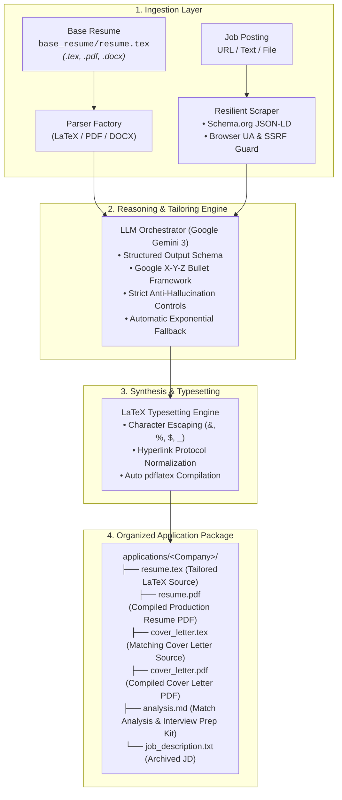

# resume-tailor

<div align="center">

[](https://github.com/Mehak769/resume-tailor/actions/workflows/ci.yml)
[](https://www.python.org/downloads/)
[](https://github.com/astral-sh/ruff)
[](https://mypy-lang.org/)
[](https://ai.google.dev/)
[](LICENSE)

**An intelligent, production-grade CLI tool that tailors software engineering resumes for specific job descriptions using LLMs and native LaTeX compilation.**

[Architecture](#architecture) • [Features](#features) • [Quick Start](#quick-start) • [Usage Options](#usage-options) • [Testing](#testing)

</div>

---

## Architecture

`resume-tailor` is built with a clean ports-and-adapters architecture, ensuring complete separation between input ingestion, LLM orchestration, and typesetting engines:



---

## Features

- **Multi-Format Ingestion**: Ingests master resumes in **LaTeX (`.tex`)**, **PDF (`.pdf`)**, or **Word (`.docx`)**.
- **Enterprise Career Portal Scraper**: Extracts jobs from career sites (Allianz, Workday, Greenhouse, Lever) via Schema.org `JobPosting` JSON-LD, with automated fallback for bot-protected pages.
- **Google X-Y-Z Bullet Optimization**: Restructures experience bullets to follow the *"Accomplished [X] as measured by [Y], by doing [Z]"* framework.
- **Strict Anti-Hallucination**: Tailors vocabulary and emphasis without inventing unheld job titles, false degrees, or fake accomplishments.
- **Native LaTeX Workflow**: Automatically updates your `.tex` source and compiles a publication-ready `.pdf` via `pdflatex` with verified, clickable web links.
- **Automated Cover Letter Generator**: Crafts an articulate, matching 1-page cover letter connecting your technical background to the target company's challenges, compiled directly to `cover_letter.pdf`.
- **Match Analysis & Interview Prep Kit**: Generates a strategic dossier (`analysis.md`) featuring ATS match metrics, skill gaps, resume change audit logs, targeted technical/behavioral interview questions with talking points, and smart questions to ask the interviewer.
- **Clean Application Tree**: Organizes each job application into its own dedicated folder (`applications/<Company>/`) with tailored resume, cover letter, analysis report, and archived job description.
- **Interactive Terminal Assistant**: Zero-friction wizard for new users—no long flags required.


---

## Quick Start

### 1. Installation

```bash
# Clone the repository
git clone git@github.com:Mehak769/resume-tailor.git
cd resume-tailor

# Install dependencies using uv
uv sync --all-extras
```

### 2. Configure Your Gemini API Key

Copy `.env.example` to `.env`:

```bash
cp .env.example .env
```

Add your Gemini API key in `.env`:

```dotenv
LLM_MODEL=gemini/gemini-3.6-flash
GEMINI_API_KEY=your_gemini_api_key_here
DEFAULT_OUTPUT_DIR=./applications
```

---

## Usage Options

### Option A: The Interactive Wizard (Recommended)
Run the launcher without any arguments:
```bash
./run.sh
```

```text
╭──────────────────────────────────────────────────────────────────╮
│ 🎯 Resume Tailor — Quick Assistant                               │
│ Easily optimize your resume for any role in seconds.             │
╰──────────────────────────────────────────────────────────────────╯
1. Path to your resume (base_resume/resume.tex): [Press Enter]
2. Paste Job Posting URL or Job Description: https://careers.company.com/job/123
3. Target Company Name (Optional, auto-detected if empty): Google
4. Preview optimizations first (dry-run)? [y/N]: n
```

---

### Option B: 1-Command Shorthand
Pass the job URL, a text string, or a local text file directly:

```bash
# Via URL
./run.sh "https://careers.allianz.com/de/de/job/102747/AI-Engineer-f-m-d"

# Via saved job description file
./run.sh job.txt -c "Allianz"
```

---

### Option C: Advanced CLI Flags
```bash
resume-tailor \
  --resume ./base_resume/resume.tex \
  --jd-url "https://careers.company.com/job/12345" \
  --company "Allianz" \
  --dry-run
```

---

## Output Structure

Every application is neatly organized in its own company folder:

```text
applications/
└── Allianz/
    ├── resume.tex           # Tailored LaTeX source code
    ├── resume.pdf           # Compiled production resume PDF
    ├── cover_letter.tex     # Matching LaTeX cover letter source
    ├── cover_letter.pdf     # Compiled 1-page cover letter PDF
    ├── analysis.md          # Strategic match analysis & interview prep kit
    └── job_description.txt  # Archived job requirements for interview prep
```

---

## CLI Reference

| Option | Flag | Default | Description |
|---|---|---|---|
| `job` | *(Arg)* | `None` | Shorthand: Job URL, text file path, or raw JD text |
| `--company` | `-c` | Auto-detected | Company name for the application folder |
| `--resume` | `-r` | `base_resume/resume.tex` | Path to master resume (`.tex`, `.pdf`, `.docx`) |
| `--jd-url` | `-u` | `None` | URL of the job posting |
| `--jd-text` | `-t` | `None` | Raw text of the job description |
| `--cover-letter` | | `True` | Generate matching tailored cover letter (`.tex` & `.pdf`) |
| `--analysis` | | `True` | Generate match analysis & interview prep kit (`analysis.md`) |
| `--output` | `-o` | `applications/<Company>/` | Custom destination file or directory |
| `--model` | `-m` | `gemini/gemini-3.6-flash` | Override default LLM model |
| `--dry-run` | | `False` | Preview match score and diff table without writing files |
| `--debug` | | `False` | Enable verbose debug logs and stack traces |

---

## Testing & Quality Assurance

The codebase enforces strict type safety and code quality:

```bash
# Run the test suite (17/17 passing)
uv run pytest

# Check code formatting & linting with Ruff
uv run ruff check .
uv run ruff format --check .

# Run strict type checking with MyPy
uv run mypy src


```

---

## Community & Contributing

Contributions are welcome! Please check our community guidelines:
- [Contributing Guide](CONTRIBUTING.md) — Setup instructions and development standards
- [Code of Conduct](CODE_OF_CONDUCT.md) — Community standards and enforcement
- [Security Policy](SECURITY.md) — Responsible vulnerability disclosure

---

## License

This project is licensed under the MIT License - see the [LICENSE](LICENSE) file for details.

